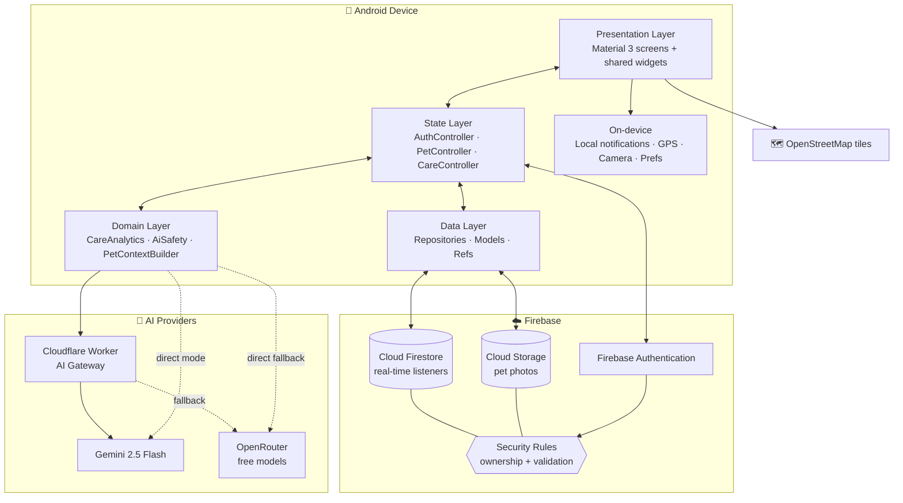
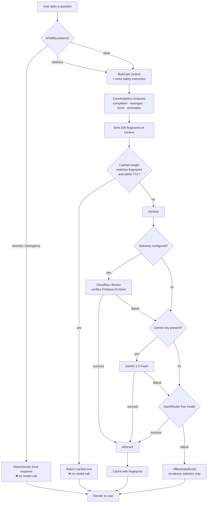
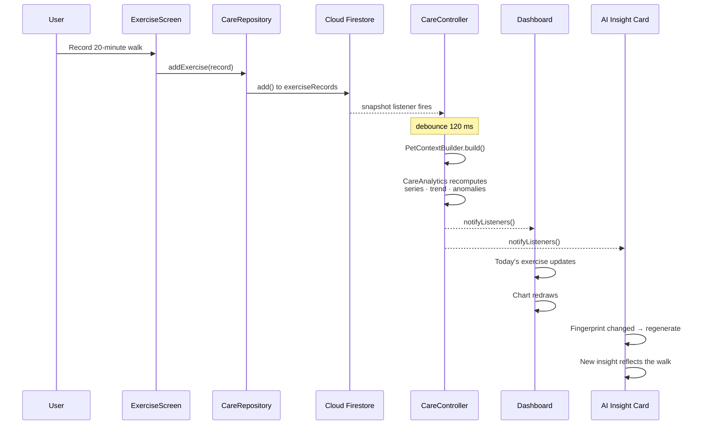
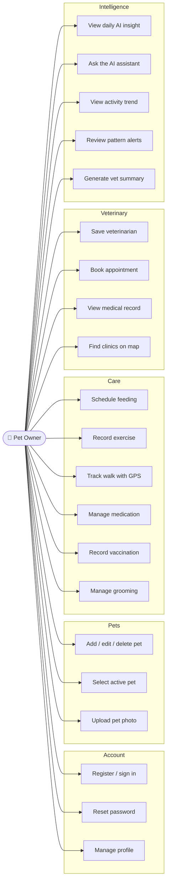
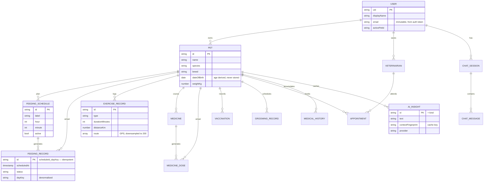
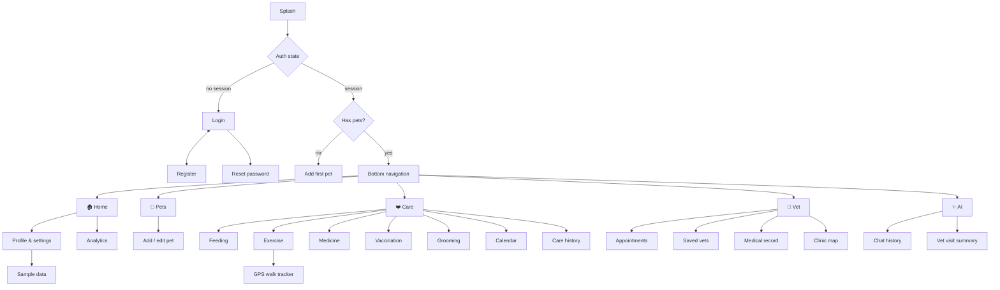
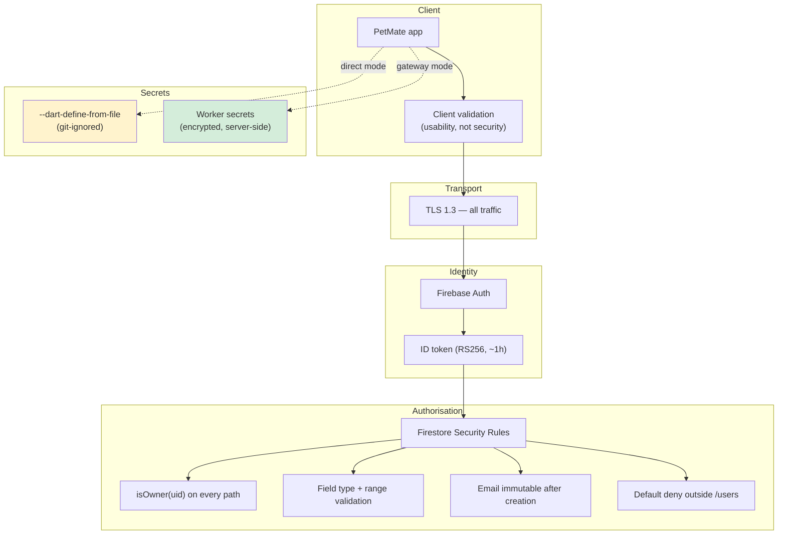
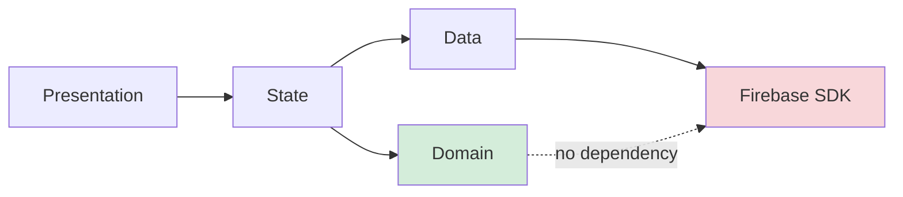

# PetMate — Architecture Reference

Diagrams and models for the CMP 7003 PRAC1 report. All diagrams are Mermaid and
render on GitHub, in VS Code, and in most Markdown-to-PDF pipelines.

---

## 1. System architecture

---

## 2. AI request flow

The critical path. Note that blocked requests terminate **before** any network
call.

---

## 3. Real-time synchronisation

What happens when the user records an exercise session.

---

## 4. Use cases

---

## 5. Firestore data model

---

## 6. Navigation

---

## 7. Security architecture

**Reading the colours:** gateway mode (green) keeps provider keys server-side.
Direct mode (amber) keeps them out of version control but not out of the APK —
the documented trade-off, with a one-line migration path.

---

## 8. Layered dependency rule

The domain layer has **no** Firebase dependency. `CareAnalytics`, `AiSafety`
and every model are pure Dart, which is why 45 unit tests run in ~3 seconds
with no emulator.
